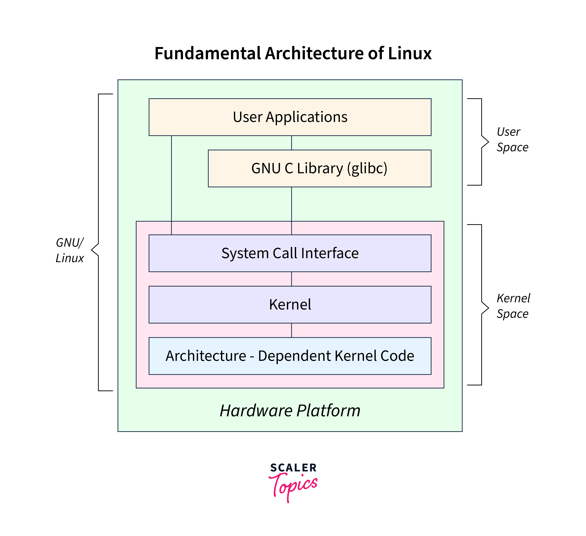

# Giới thiệu

Trong Embedded Linux, build image là quá trình tạo ra một tệp tin chứa toàn bộ hệ điều hành Linux và các thành phần cần thiết để chạy trên một thiết bị nhúng (embedded device). Tệp tin này thường được gọi là image (ảnh hệ thống), và nó bao gồm kernel, hệ thống tệp (filesystem), các thư viện, và các ứng dụng cần thiết.

---
## Các bước build image và từng thành phần liên quan:
---
### 1. Chuẩn bị môi trường làm việc:
**Mục tiêu:** Thiết lập máy tính phát triển sẵn sàng để biên dịch và tạo image.
**Thành phần:**
* **Hệ điều hành Linux:** hệ điều hành Linux là nền tảng phổ biến được sử dụng trong phát triển Embedded Linux nhờ khả năng tương thích tốt với các công cụ mã nguồn mở và hỗ trợ phong phú từ cộng đồng. Một trong những lý do chính là Linux cung cấp môi trường mạnh mẽ và tiện ích hệ thống tối ưu cho việc phát triển phần mềm nhúng. Các công cụ như GCC (trình biên dịch), binutils (bộ công cụ thao tác tệp nhị phân), make (hệ thống xây dựng tự động), và các tiện ích như sed, awk, và grep được thiết kế để chạy tốt trên Linux. Ngoài ra, Linux còn có các trình quản lý gói mạnh mẽ như apt hoặc yum, giúp dễ dàng cài đặt các thư viện và công cụ cần thiết. Do Linux hỗ trợ đa nền tảng, các nhà phát triển có thể dễ dàng tùy chỉnh hệ thống để xây dựng kernel, root filesystem, hoặc bất kỳ thành phần nào cần thiết cho thiết bị nhúng. Đặc biệt, Linux là hệ điều hành mã nguồn mở, cho phép các nhà phát triển tự do thay đổi hoặc tối ưu hệ thống theo yêu cầu cụ thể của phần cứng và ứng dụng. Bên cạnh đó, với sự phổ biến trong lĩnh vực nhúng, cộng đồng lớn mạnh của Linux cũng giúp các nhà phát triển dễ dàng nhận được hỗ trợ hoặc tìm kiếm giải pháp cho các vấn đề phát sinh. 
* **Toolchain:** Toolchain là tập hợp các công cụ cần thiết để biên dịch và liên kết mã nguồn thành tệp nhị phân có thể chạy trên thiết bị nhúng. Trong Embedded Linux, toolchain đóng vai trò cốt lõi vì thiết bị nhúng thường sử dụng kiến trúc CPU khác với máy tính phát triển. Một toolchain điển hình bao gồm trình biên dịch (compiler), như GCC, để chuyển đổi mã nguồn (C, C++) thành mã máy; trình liên kết (linker), như GNU ld, để liên kết các tệp đối tượng thành tệp thực thi hoặc thư viện; và thư viện chuẩn (standard libraries), như glibc, uClibc hoặc musl, cung cấp các hàm hệ thống cơ bản. Ngoài ra, toolchain cũng bao gồm các công cụ hỗ trợ khác như trình gỡ lỗi (GDB) hoặc assembler (GNU as). Quá trình cross-compilation sử dụng toolchain để biên dịch mã trên một máy tính phát triển (thường là x86/x64) thành mã nhị phân chạy trên thiết bị nhúng (ARM, MIPS, RISC-V, v.v.), do kiến trúc phần cứng khác biệt. Các toolchain phổ biến như Linaro GCC, Yocto SDK, hoặc Buildroot Toolchain được thiết kế để tối ưu hóa quá trình này, hỗ trợ không chỉ kernel mà còn bootloader và root filesystem. Việc lựa chọn đúng toolchain phù hợp với kiến trúc CPU và hệ thống phần cứng sẽ đảm bảo hiệu suất và sự ổn định của hệ điều hành nhúng.

### 2. Thu thập mã nguồn cần thiết:
**Mục tiêu:** Thu thập tất cả các phần cần thiết để xây dựng hệ điều hành
**Thành phần:**
* **Kernel:** Kernel Linux, hay nhân hệ điều hành, là thành phần cốt lõi của một hệ điều hành Linux, chịu trách nhiệm chính trong việc giao tiếp giữa phần cứng và phần mềm. Nhiệm vụ chính của kernel là quản lý tài nguyên hệ thống như CPU, bộ nhớ, và thiết bị ngoại vi (USB, mạng, bộ lưu trữ, v.v.), đồng thời cung cấp một giao diện lập trình chung (API) để các ứng dụng hoặc tiến trình người dùng có thể tương tác với phần cứng mà không cần biết chi tiết cụ thể về phần cứng đó. Kernel Linux được thiết kế để hoạt động trên nhiều kiến trúc CPU khác nhau, từ các thiết bị nhúng nhỏ gọn (ARM, MIPS) cho đến các siêu máy tính (x86_64, RISC-V). Trong thiết bị nhúng, kernel thường được tùy chỉnh để chỉ bao gồm các module cần thiết, nhằm tiết kiệm tài nguyên và đảm bảo hiệu suất cao. Một số thành phần quan trọng của kernel bao gồm quản lý tiến trình (scheduling), quản lý bộ nhớ (memory management), và hỗ trợ driver, cho phép kernel điều khiển thiết bị phần cứng cụ thể như cảm biến, bộ thu phát tín hiệu, hoặc bộ vi điều khiển. Nhờ tính linh hoạt, mã nguồn mở và khả năng tùy biến cao, kernel Linux là lựa chọn hàng đầu trong các hệ thống nhúng.
* **Bootloader:** Bootloader là một chương trình nhỏ nhưng rất quan trọng, chịu trách nhiệm khởi động hệ điều hành trên thiết bị. Khi một thiết bị được bật nguồn, bộ xử lý (CPU) sẽ tìm kiếm và thực thi bootloader đầu tiên, vì đây là chương trình đầu tiên được nạp vào bộ nhớ để khởi động hệ thống. Bootloader thực hiện các nhiệm vụ như kiểm tra trạng thái phần cứng, khởi tạo các thành phần quan trọng (như RAM, CPU), và nạp kernel vào bộ nhớ để bắt đầu quá trình vận hành hệ điều hành. Trong hệ thống nhúng, U-Boot (Universal Bootloader) là một trong những bootloader phổ biến nhất, nhờ khả năng hỗ trợ nhiều kiến trúc CPU (ARM, x86, MIPS) và tính linh hoạt cao. Bootloader cũng thường được thiết kế để cung cấp một giao diện đơn giản cho phép người dùng hoặc nhà phát triển sửa đổi tham số khởi động, chọn kernel, hoặc nạp hệ điều hành qua giao thức mạng (TFTP) hoặc bộ nhớ ngoài (SD card, USB). Với vai trò là cầu nối giữa phần cứng và kernel, bootloader đảm bảo rằng hệ thống được khởi động một cách ổn định và chính xác.
*  **Root Filesystem:** Root filesystem là hệ thống tệp gốc trong Linux, chứa tất cả các tệp và thư mục cần thiết để hệ điều hành và ứng dụng vận hành. Đây là nơi kernel sẽ gắn kết (mount) khi khởi động để truy cập các thư viện, tệp cấu hình, và chương trình. Root filesystem bao gồm các thành phần quan trọng như thư mục /bin (chứa các tiện ích cơ bản như ls, cp), /lib (chứa thư viện hệ thống cần thiết để các chương trình hoạt động), /etc (các tệp cấu hình), và /dev (các tệp đại diện cho thiết bị phần cứng). Trong hệ thống nhúng, root filesystem thường được tạo ra bằng cách sử dụng các công cụ như BusyBox (cung cấp các công cụ dòng lệnh nhỏ gọn) và có thể được nén (sử dụng squashfs, cramfs) để tiết kiệm dung lượng bộ nhớ. Root filesystem cũng có thể được tùy chỉnh để chỉ bao gồm những thành phần cần thiết, giúp tối ưu hóa hiệu suất và sử dụng tài nguyên. Ngoài ra, nó cũng chứa các ứng dụng người dùng, chẳng hạn như giao diện điều khiển hoặc chương trình điều khiển thiết bị. Với vai trò là nền tảng vận hành toàn bộ hệ thống, root filesystem là một trong những thành phần quan trọng nhất để đảm bảo hệ điều hành nhúng hoạt động chính xác và hiệu quả.
### 3. Cấu hình Kernel:
**Cấu hình kernel** là bước để tùy chỉnh kernel Linux nhằm đáp ứng yêu cầu cụ thể của thiết bị nhúng. Kernel cần được điều chỉnh để chỉ bao gồm những tính năng và driver thực sự cần thiết, giúp tối ưu hóa tài nguyên và hiệu suất. Quá trình cấu hình bắt đầu bằng việc xác định kiến trúc phần cứng, chẳng hạn như loại CPU (ARM, MIPS, x86, v.v.) và các thông số kỹ thuật của thiết bị. Tiếp theo, các driver được bật hoặc tắt dựa trên phần cứng thực tế, như Ethernet, USB, Wi-Fi, hoặc GPIO. Ngoài ra, loại hệ thống tệp (filesystem) mà kernel sẽ hỗ trợ, chẳng hạn như ext4 hoặc squashfs, cũng được lựa chọn tại bước này. Việc cấu hình chính xác kernel đảm bảo rằng hệ thống hoạt động ổn định và tối ưu, đồng thời giảm dung lượng tổng thể của image.
### 4. Build Kernel:
**Build kernel** là bước biên dịch mã nguồn kernel Linux thành một tệp nhị phân có thể khởi động được trên thiết bị nhúng. Quá trình này sử dụng toolchain đã được thiết lập trước đó để đảm bảo mã nguồn được chuyển đổi thành mã máy phù hợp với kiến trúc phần cứng. Kết quả của quá trình build kernel thường là một tệp nhị phân kernel chính, như zImage hoặc uImage, sẽ được nạp vào RAM khi khởi động. Ngoài ra, tệp Device Tree Blob (DTB) cũng được tạo ra để mô tả các thành phần phần cứng của thiết bị, giúp kernel hiểu cách giao tiếp với các thiết bị ngoại vi như cổng GPIO, SPI, hoặc I2C. Việc build kernel thành công là một bước quan trọng để đảm bảo rằng hệ điều hành có thể giao tiếp chính xác với phần cứng và khởi động một cách ổn định.
### 5. Build Bootloader:
**Build bootloader** là bước tạo ra chương trình khởi động hệ điều hành. Bootloader là phần mềm đầu tiên được chạy khi thiết bị nhúng khởi động, với nhiệm vụ kiểm tra trạng thái phần cứng, khởi tạo bộ nhớ, và nạp kernel vào RAM. Trong hệ thống nhúng, bootloader phổ biến nhất là U-Boot, nhờ vào tính linh hoạt và khả năng hỗ trợ nhiều kiến trúc CPU khác nhau. Trong quá trình build bootloader, các thông tin về cấu hình bộ nhớ, kiến trúc CPU, và các thông số phần cứng cụ thể được thiết lập để bootloader có thể khởi động đúng cách. Một bootloader được xây dựng và cấu hình chính xác là bước cần thiết để đảm bảo kernel có thể được tải và bắt đầu chạy trên thiết bị.
### 6. Tạo root filesystem:
**Tạo root filesystem** là bước xây dựng hệ thống tệp gốc, nơi chứa tất cả các thành phần cần thiết để hệ điều hành nhúng hoạt động. Root filesystem bao gồm các tiện ích dòng lệnh cơ bản (như ls, cp), được cung cấp bởi các công cụ tối ưu như BusyBox, giúp giảm kích thước tổng thể. Ngoài ra, root filesystem còn chứa các thư viện hệ thống như glibc, uClibc, hoặc musl, cung cấp các hàm cơ bản để chương trình hoạt động. Cuối cùng, các ứng dụng người dùng, chẳng hạn như giao diện điều khiển hoặc phần mềm tùy chỉnh, cũng được thêm vào đây. Root filesystem có thể được nén bằng squashfs hoặc cramfs để tiết kiệm dung lượng bộ nhớ. Một root filesystem đầy đủ và tối ưu là nền tảng để hệ điều hành nhúng hoạt động chính xác và hiệu quả.
### 7. Đóng gói image:
**Đóng gói image** là bước kết hợp kernel, bootloader, và root filesystem thành một tệp image duy nhất để dễ dàng cài đặt và sử dụng trên thiết bị nhúng. Tệp image thường có định dạng .img hoặc .bin, chứa toàn bộ hệ điều hành và các thành phần cần thiết. Trong bước này, root filesystem thường được nén để giảm kích thước và tối ưu hóa tốc độ tải. Image được đóng gói cũng có thể bao gồm các thông số khởi động cụ thể hoặc dữ liệu bổ sung để đảm bảo hệ thống khởi động một cách trơn tru. Việc đóng gói đúng cách đảm bảo rằng tất cả các thành phần của hệ điều hành được tích hợp và sẵn sàng hoạt động trên thiết bị.
### 8. Flash image lên thiết bị:
**Flash image*** lên thiết bị là bước ghi tệp image đã đóng gói vào bộ nhớ của thiết bị nhúng, chẳng hạn như eMMC, thẻ SD, hoặc bộ nhớ NAND/NOR flash. Quá trình này thường sử dụng các công cụ như dd, fastboot, hoặc các tiện ích đặc thù được cung cấp bởi nhà sản xuất thiết bị. Flashing đảm bảo rằng toàn bộ hệ điều hành và các thành phần liên quan được cài đặt trên thiết bị để nó có thể khởi động và vận hành. Đây là bước cuối cùng để chuyển hệ điều hành từ máy phát triển sang thiết bị thực tế.
### 9. Kiểm tra hệ thống:
**Kiểm tra hệ thống** là bước xác minh rằng image đã được cài đặt hoạt động đúng cách trên thiết bị nhúng. Quá trình này thường sử dụng *ổng giao tiếp như serial port, Ethernet, hoặc USB để ghi lại log hệ thống và kiểm tra lỗi trong quá trình khởi động. Log hệ thống cung cấp thông tin chi tiết về trạng thái khởi động của kernel, root filesystem, và các dịch vụ liên quan. Ngoài ra, các công cụ gỡ lỗi có thể được sử dụng để xác định và sửa lỗi nếu có sự cố xảy ra. Kiểm tra kỹ lưỡng đảm bảo rằng thiết bị hoạt động ổn định và đáp ứng các yêu cầu của hệ điều hành nhúng.


# Build Image cho Board BeagleBone Black
---

## **1. Tải Toolchain và Cài đặt Biến Môi Trường**
### Lệnh:
```bash
wget -c https://releases.linaro.org/components/toolchain/binaries/6.5-2018.12/arm-linux-gnueabihf/gcc-linaro-6.5.0-2018.12-x86_64_arm-linux-gnueabihf.tar.xz
tar xf gcc-linaro-6.5.0-2018.12-x86_64_arm-linux-gnueabihf.tar.xz
export CC=`pwd`/gcc-linaro-6.5.0-2018.12-x86_64_arm-linux-gnueabihf/bin/arm-linux-gnueabihf-
${CC}gcc --version
```

### Giải thích:
1. **`wget`**: Tải toolchain Linaro GCC từ Internet. Toolchain này được sử dụng để biên dịch mã nguồn cho kiến trúc ARM.
2. **`tar xf`**: Giải nén file đã tải về (`.tar.xz`) để sử dụng.
3. **`export CC`**: Đặt biến môi trường `CC` trỏ đến trình biên dịch (`gcc`) của toolchain.
4. **`${CC}gcc --version`**: Kiểm tra phiên bản của trình biên dịch để đảm bảo toolchain đã được thiết lập chính xác.

---

## **2. Tải mã nguồn U-Boot và áp dụng bản vá**
### Lệnh:
```bash
git clone -b v2019.04 https://github.com/u-boot/u-boot --depth=1
cd u-boot/
git pull --no-edit https://github.com/beagleboard/u-boot v2019.04-bbb.io-am335x
```

### Giải thích:
1. **`git clone`**: Tải mã nguồn U-Boot phiên bản `v2019.04` từ GitHub.
2. **`cd u-boot/`**: Chuyển vào thư mục chứa mã nguồn U-Boot.
3. **`git pull`**: Áp dụng bản vá từ kho lưu trữ U-Boot của BeagleBoard cho phiên bản tương thích với BeagleBone Black (`v2019.04-bbb.io-am335x`).

---

## **3. Build U-Boot**
### Lệnh:
```bash
make ARCH=arm CROSS_COMPILE=${CC} distclean
make ARCH=arm CROSS_COMPILE=${CC} am335x_evm_defconfig
make ARCH=arm CROSS_COMPILE=${CC}
```

### Giải thích:
1. **`make distclean`**: Xóa các tệp cấu hình và build trước đó để đảm bảo môi trường sạch sẽ.
2. **`make am335x_evm_defconfig`**: Tải cấu hình mặc định cho board BeagleBone Black (`am335x`).
3. **`make`**: Biên dịch mã nguồn U-Boot sử dụng toolchain ARM (`CROSS_COMPILE=${CC}`).

---

## **4. Tải mã nguồn Linux và áp dụng bản vá**
### Lệnh:
```bash
cd ../
git clone https://github.com/RobertCNelson/bb-kernel
cd bb-kernel/
git checkout origin/am33x-v5.4 -b tmp
```

### Giải thích:
1. **`git clone`**: Tải mã nguồn kernel Linux từ kho lưu trữ.
2. **`git checkout`**: Chuyển sang nhánh `am33x-v5.4`, phù hợp với BeagleBone Black.

---

## **5. Build Kernel**
### Lệnh:
```bash
./build_kernel.sh
```

### Giải thích:
1. **`./build_kernel.sh`**: Chạy script tự động để cấu hình và biên dịch kernel cho board BeagleBone Black.

---

## **6. Tải và giải nén root filesystem**
### Lệnh:
```bash
wget -c https://rcn-ee.com/rootfs/eewiki/minfs/debian-10.10-minimal-armhf-2021-06-20.tar.xz
tar xf debian-10.10-minimal-armhf-2021-06-20.tar.xz
```

### Giải thích:
1. **`wget`**: Tải root filesystem Debian tối giản dành cho kiến trúc ARM.
2. **`tar xf`**: Giải nén root filesystem đã tải về.

---

## **7. Xóa dữ liệu trên thẻ SD**
### Lệnh:
```bash
export DISK=/dev/sdb
sudo dd if=/dev/zero of=${DISK} bs=1M count=10
```

### Giải thích:
1. **`export DISK`**: Đặt biến môi trường `DISK` trỏ đến thiết bị thẻ SD.
2. **`sudo dd`**: Ghi dữ liệu `0` vào thẻ SD để xóa các dữ liệu cũ và đảm bảo không còn phân vùng.

---

## **8. Cài đặt U-Boot lên thẻ SD**
### Lệnh:
```bash
sudo dd if=./u-boot/MLO of=${DISK} count=1 seek=1 bs=128k
sudo dd if=./u-boot/u-boot.img of=${DISK} count=2 seek=1 bs=384k
```

### Giải thích:
1. **`sudo dd` (MLO)**: Ghi file MLO (Minimal Loader) của U-Boot vào vị trí đầu tiên của thẻ SD.
2. **`sudo dd` (u-boot.img)**: Ghi file `u-boot.img` vào thẻ SD, nơi chứa chương trình khởi động U-Boot.

---

## **9. Tạo phân vùng trên thẻ SD**
### Lệnh:
```bash
sudo sfdisk ${DISK} <<-__EOF__
4M,,L,*
__EOF__

sudo mkfs.ext4 -L rootfs -O ^metadata_csum,^64bit ${DISK}1
```

### Giải thích:
1. **`sfdisk`**: Tạo phân vùng mới bắt đầu từ sector 4MB và sử dụng toàn bộ dung lượng còn lại.
2. **`mkfs.ext4`**: Định dạng phân vùng mới với hệ thống tệp ext4 và gắn nhãn `rootfs`.

---

## **10. Ghi dữ liệu vào thẻ SD**
### Lệnh:
```bash
sudo mkdir -p /media/rootfs/
sudo mount ${DISK}1 /media/rootfs/

sudo mkdir -p /media/rootfs/opt/backup/uboot/
sudo cp -v ./u-boot/MLO /media/rootfs/opt/backup/uboot/
sudo cp -v ./u-boot/u-boot.img /media/rootfs/opt/backup/uboot/
```

### Giải thích:
1. **`mkdir`**: Tạo thư mục để gắn kết phân vùng `rootfs`.
2. **`mount`**: Gắn kết phân vùng thẻ SD vào thư mục `/media/rootfs/`.
3. **`cp`**: Sao chép file MLO và u-boot.img vào thư mục backup trên thẻ SD.

---

## **11. Cài đặt Kernel và Root Filesystem**
### Lệnh:
```bash
export kernel_version=5.4.129-bone55

sudo tar xfvp ./debian-*-*-armhf-*/armhf-rootfs-*.tar -C /media/rootfs/
sync
sudo chown root:root /media/rootfs/
sudo chmod 755 /media/rootfs/

sudo sh -c "echo 'uname_r=${kernel_version}' >> /media/rootfs/boot/uEnv.txt"
sudo cp -v ./bb-kernel/deploy/${kernel_version}.zImage /media/rootfs/boot/vmlinuz-${kernel_version}
sudo mkdir -p /media/rootfs/boot/dtbs/${kernel_version}/
sudo tar xfv ./bb-kernel/deploy/${kernel_version}-dtbs.tar.gz -C /media/rootfs/boot/dtbs/${kernel_version}/
sudo tar xfv ./bb-kernel/deploy/${kernel_version}-modules.tar.gz -C /media/rootfs/
```

### Giải thích:
1. **`tar`**: Giải nén root filesystem vào thẻ SD.
2. **`chown` và `chmod`**: Thiết lập quyền sở hữu và quyền truy cập.
3. **`echo`**: Thêm phiên bản kernel vào file cấu hình `uEnv.txt`.
4. **`cp`**: Sao chép kernel (`zImage`), device tree blobs (DTBs), và module kernel vào thẻ SD.

---

## **12. Cấu hình mạng**
### Lệnh:
```bash
sudo nano /media/rootfs/etc/network/interfaces
```

#### Nội dung file:
```bash
auto lo
iface lo inet loopback
 
auto eth0
iface eth0 inet dhcp
```

### Giải thích:
1. **`nano`**: Mở file cấu hình mạng.
2. **Cấu hình mạng**: Thiết lập giao diện `eth0` để tự động nhận địa chỉ IP từ DHCP.

---

## **13. Hoàn tất**
### Lệnh:
```bash
sync
sudo umount /media/rootfs
```

### Giải thích:
1. **`sync`**: Đảm bảo tất cả dữ liệu đã được ghi vào thẻ SD.
2. **`umount`**: Tháo phân vùng thẻ SD an toàn.


